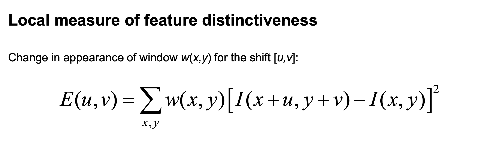
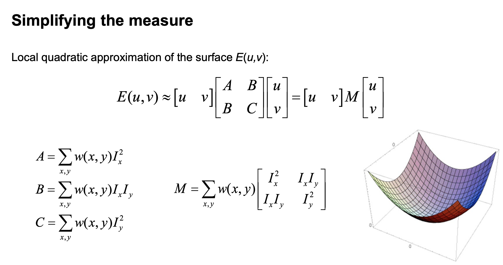
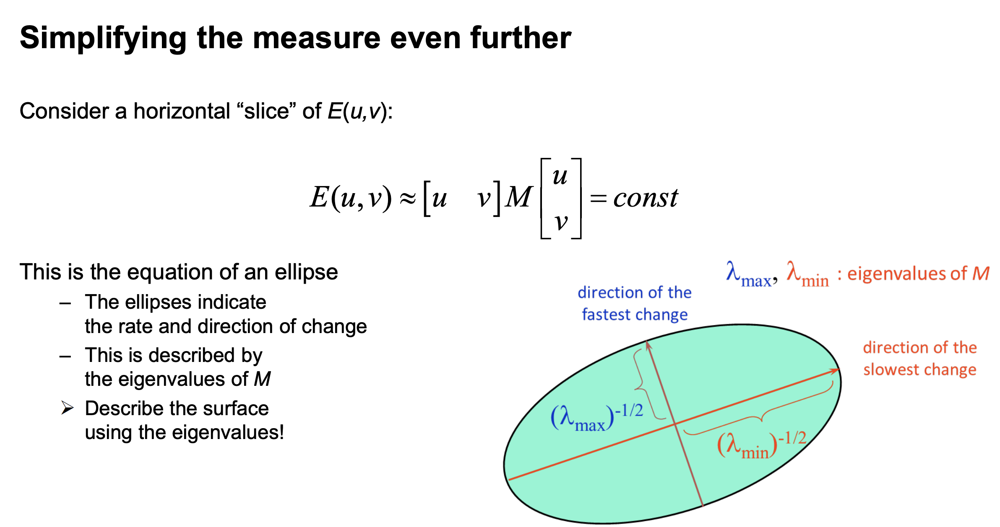
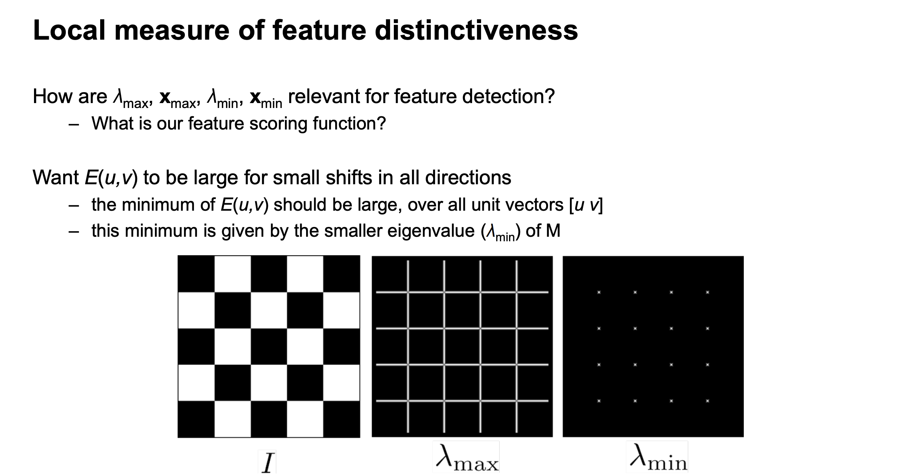
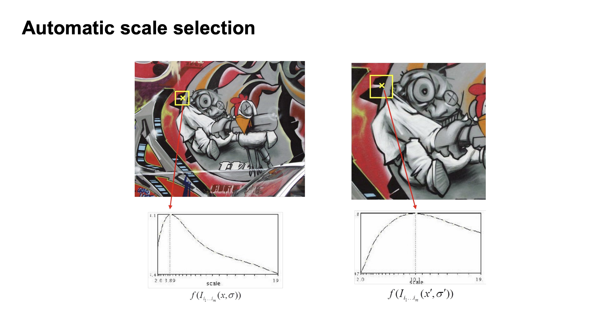
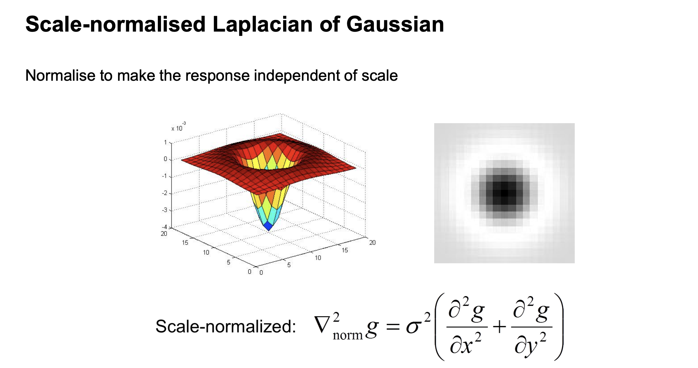
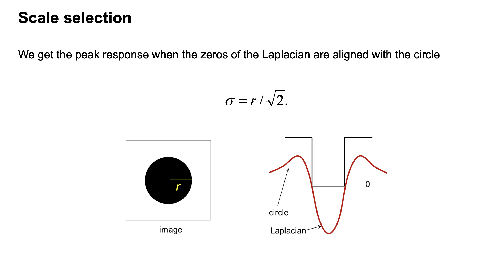
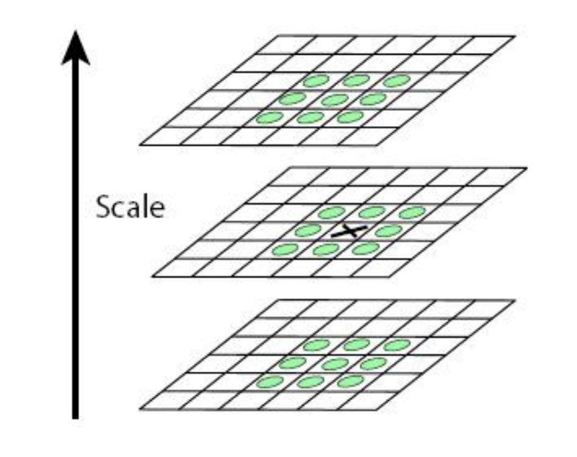

# Lab

# Todo - understand non-maximum suppression

## 1 - Overview

## 2 - Corner feature detecture from scratch 

## 3 - Circle detection with RANSAC

# Lecture 
## Line features
- Edges and lines
- Thinning and thresholding 
detection of local maxima along the gradient + thresholding => binary image with isolated edges (single pixels at discrete locations along edge contours)
- Difference of Gaussians (DoG), Derivative of Gaussians, Sobel, Canny, ...
- Laplacian of Gaussian -> find zero crossings (thresholded to remove ALL zero-crossings)
    - DoG is approx of LoG
- Edge images (binary image) - How to connect these edge pixels to identify lines in the image -> find lines using sinusoids (Hough transform, ro, theta)  
    - Intersection of several sinusoids is a line (in the "Accumulator")
    - Hough transform can be generalized to other shapes! 

## Keypoint features
Specific locations in an image where we can reliably find correspondences with other images
= Interest points = landmarks = corners

Feature correspondence matching process: 
1. Detect a set of *distinct* feature points (dinstinct)
2. Define a patch around each point (locality)
3. Extract and normalize the patch
4. Compute a local descriptor 
5. Match local descriptors

### Characteristics of good features --> IMPORTANT
**
- Repeatability
- Distinctiveness
- Efficiency (sparse calculation)
- Locality
**

### Corners

Corner features are not robust to scaling! Therefore:
- Scale-testing corner features
- or use blob features

Simplifying measure - use local first order taylor expansion of image
to calculate a local quadratic approximation of E(u,v) (local measure of feature distinctiveness)

Alternatives to lambda_min:
- Harris
- Harmonic Mean

Because corner detection is not invariant to scaling, we use automatic scale selection
=> test same region, find maximum for different scales 

### Blobs

Selecting the characteristic scale 
=> We define the characteristic scale
as the scale that produces the peak scale-normalised Laplacian response

At what scale does the scale-normalised Laplacian
achieve a maximum response to a binary circle of radius r?

=> finding maxima and minima of scale-normalised LoG operator in **SPACE and SCALE**

#### LoG Blob Detector
1. Convolve the image with scale-normalised LoG at different scales
2. Find maxima of squared LoG response in scale-space

## Robust estimation with RANSAC
- RANSAC mostly used for removing outliers/noise from a dataset

